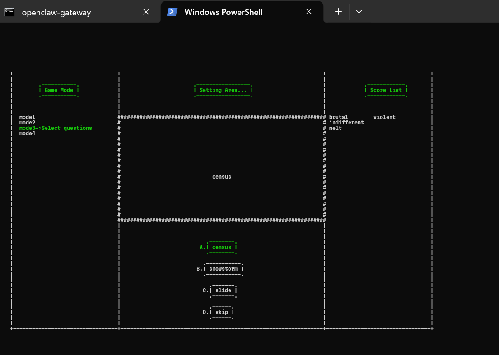
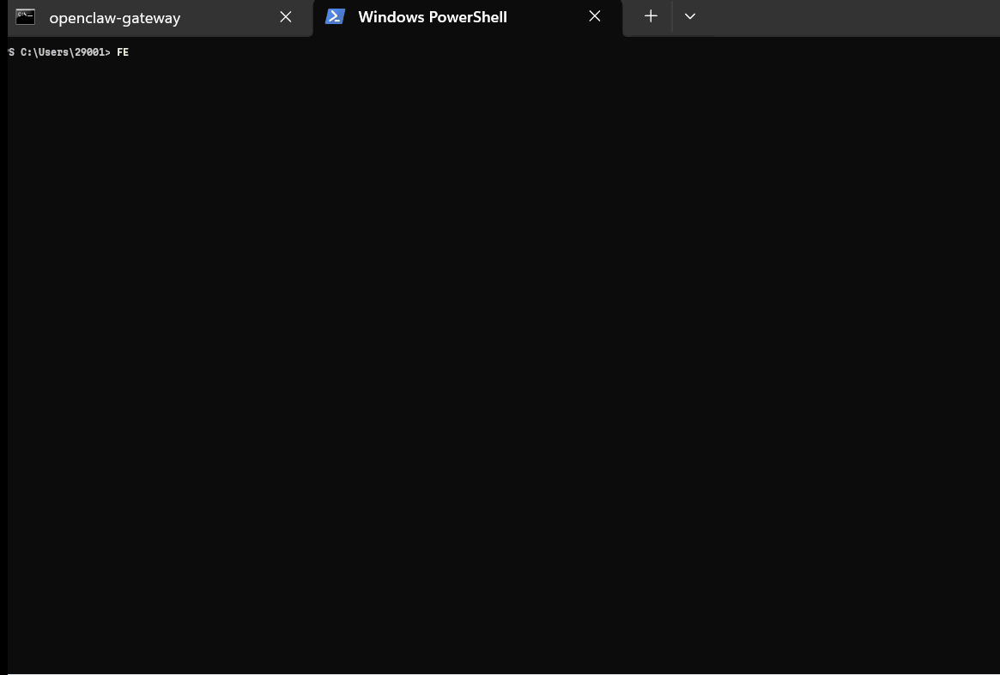
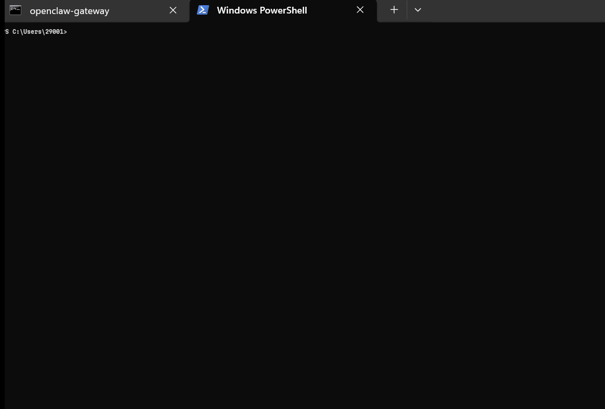

FE,whose full name is Funny English, And as you think, this is a sample ENGLISH HELPER MOMORIZE tool.
## 一、Layout
5 areas will be provided in fe.

### 1.mode selection area
The leftmost rectangle area is the mode selection area. we can select 4 modes by press the arrow keys.

### 2.setting area
The middle top area is the setting area,we can set details about the game by selecting this area.

### 3.game question area
The very middle area is the game question area, and we can see the question provided by the different game mode.

### 4.game answer area
The middle bottom area is the game answer area, and we can answer the question by selecting this area.

### 5.score list area
The rightmost rectangle area is the score list area, and the quality of what you answer will be showed in the area by right or wrong word.

 
 ## 二、Functions

### 1.flash introduction
This project is divided into 2 parts in logic, one is flash mode,and the another is the game mode.
the flash mode is the epitome of each mode lies in the left of the whole screen. we default enter the flash mode, which shows every mode's function and introduction.

The details below is about the flash mode:

And as the gif above,we can select modes by press the arrow keys.

### 2.game modes
We will check out the game modes in fe:
There are 3 modes in fe:
#### 2.1. words bounce off walls

English words bounce off walls just like the startup screen of old black-and-white TV sets from childhood.That's totally funny and completely decompression.

the function of this level as the following gif:

#### 2.2 T_F questions of word

There are an English word as the origin material and a definition the  provided by the question,and on the screen.
You task is that judge whether the definition is the corresponding definition of the word. Just by covert the arrow direction pointing Yes(T) or No(F) button.

All of level 2.2 said just now could be explain by the following gif:

And To add the following two points：

1. the score list will collect the quality of what you answer, essentially, it'll show the right or wrong word you just answerd.

2. we just use the word vocabulary instead of the definition,because the unkind of window's shell which cann't support the Chinese display.

### 3.Selectd Questions
Same as above an origon ENglish word will be provided,and you must choose one corresponding item from ABCD options.
The collection system will work in the same time.

