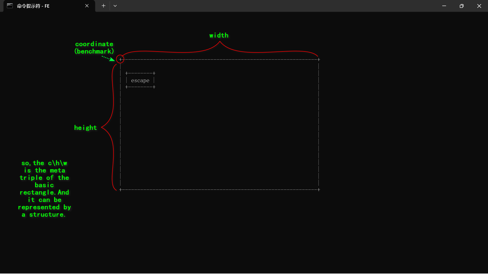

# 1.layout of the software
### 1.1 basic layout of static rectangle

look at this:



so the rectangle shape could be represented by the following strcucture:
```c
typedef struct coordinate {
    int x;
    int y;
}Coordinate;

typedef struct width_and_height {
    int width;
    int height;
}Width_And_Height;

typedef char Corner;
typedef char Vertical;
typedef char Horizontal;

typedef struct pattern{
    Corner corner;
    Vertical vertical;
    Horizontal horizontal;
}Pattern;

typedef struct rectangle {
    Coordinate coordinate;
    Width_And_Height width_and_height;
    Pattern pattern;
}Rectangle;
```
and the default shell has 80 cells in width and 40 cells in height.and we just allocate a rectangle of 66 cells in width and 4 cells in height.
```c
// +----------------------------------------------------------------+
// |
// |
// ....
// +----------------------------------------------------------------+
#define LARGE_BORDER_CORNER '+'
#define LARGE_BORDER_X 38
#define LARGE_BORDER_Y 6
#define LARGE_BORDER_WIDTH 66
#define LARGE_BORDER_HEIGHT 20
```
and the following is word block
```c
#define WORD_BORDER_CORNER '+'
```

why just list the corner of the word?Apparently there'll be verious word,and the width and height will be repesented by the length of the specific character that as the passed parameter.
```c
#define WORD_BORDER_CORNER '+'
```

### 1.2 basic layout of dynamic rectangle
Since the word block will move every single second,so we must do something dynamic stuff about the coordinate of the word block.
We use the 2-dimensions array to store the directions that the word may go next.

```c
typedef int Directions;
static Directions directions[4][2] = {
    {1, 1},//bottom-right
    {1, -1},//top-right
    {-1, -1},//top-left
    {-1, 1}; //bottom-left
};

typedef enum direction {
    BOTTOM_RIGHT,
    TOP_RIGHT,
    TOP_LEFT,
    BOTTOM_LEFT;
} Direction;//then we can use directions[Direction] to get the coordinate of the next cell.

```
Last but the not least, Words adopt the structure below.
```c
typedef char* String;
typedef struct word {
    Rectangle rectangle;
    String word;
    Direction direction;
}Word;
```

# 2. the logic of single word
### 2.1 clear
First we just hide the cursor and clear the screen which could be done by the following system function:
```c
void hide_cursor()
{
    CONSOLE_CURSOR_INFO cursorInfo;
    GetConsoleCursorInfo(GetStdHandle(STD_OUTPUT_HANDLE), &cursorInfo);
    cursorInfo.bVisible = FALSE;
    SetConsoleCursorInfo(GetStdHandle(STD_OUTPUT_HANDLE), &cursorInfo);
}
cls();
```
### 2.2 init srceen
Second, we init the whole outermost rectangle with the corner of '+'.
```c
Rectangle* large_rectangle = {{LARGE_BORDER_X, LARGE_BORDER_Y}, {LARGE_BORDER_WIDTH, LARGE_BORDER_HEIGHT}};
```

### 2.3 init word block
Same as the `2.1`,we can randomly initize a word loaded from the file. Considering at the v1.0, we just Hard-Code in the C file.

```c
String s_abandon_ = {"abandon"};// this is the abbreviate of string_abandon_
Word w_abandon_ = {{x,y}, "abandon"};// this is the abbreviate of word_abandon_
// and we need to randomize the coordinate of the random word block.
int x = rand() % (LARGE_BORDER_WIDTH - strlen(s_abandon_));
int y = rand() % (LARGE_BORDER_HEIGHT - 1);

// AND we can use the function print_word which is consisted of print_rectangle function and print_string function to print the word
void print_word(Word word){
    print_rectangle(word.rectangle);
    print_string(word.rectangle.coordinate,word.word);
}
```

### 2.4 move the word
The key idea of movement is changing the coordinate the word block.And first it will be initized with a default direction.
```c
void move_word(Word* word){
    word->rectangle.coordinate.x += directions[word->direction][0];
    word->rectangle.coordinate.y += directions[word->direction][1];
}
```
and we must check the word block whether it will out of the outermost rectangle(called srceen, but you know not the physical srceen,laughing ^_^).

```c
bool check_out_of_bound(Word* word){
    return word->rectangle.coordinate.x < 0 || word->rectangle.coordinate.x >= LARGE_BORDER_WIDTH || word->rectangle.coordinate.y < 0 || word->rectangle.coordinate.y >= LARGE_BORDER_HEIGHT;
}
/*


*/
void handle_out_of_bound(Word* word){
    if(check_out_of_bound(word)){
        word->direction = (word->direction + 1) % 4;
    }
}
```
we now encounter the issue of print the word block after movement.It has 2 steps:

- clear the previous word block:solved by print ' ' and we can also call the function print_rectangle.

- print the new word block:solved by print_word function

```c
// xxxxxxx just omit the code !
```
### 2.5 change the word
2 steps same as above:

- clear the previous word block.

- print the new word block.

```c
// xxxxxxx just omit the code !
```

OK! Up to this point, we have a movable, configurable single word block similar to the black-and-white TV sets our elders grew up with.

