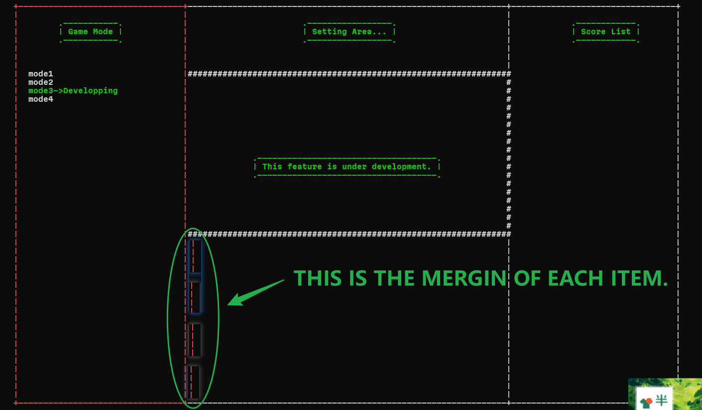

# coordinates
according this metric and the coordinates of four items  is as follows:


```c
#define COORDINATE_ITEM1_X border_x
#define COORDINATE_ITEM1_Y border_y+Border_height+1

#define COORDINATE_ITEM1_X border_x
#define COORDINATE_ITEM1_Y border_y+Border_height+1+word_margin+1

#define COORDINATE_ITEM1_X border_x
#define COORDINATE_ITEM1_Y border_y+Border_height+1+2*(word_margin+1)

#define COORDINATE_ITEM1_X border_x
#define COORDINATE_ITEM1_Y border_y+Border_height+1+3*(word_margin+1)
```

and we must get four item randomly from the set, and one of them is the right answer.
we could use a array to achieve this function.
```c
#define MAX_ITEM_ARRAY_SIZE 4
String_and_meaning * array_4_item[MAX_ITEM_ARRAY_SIZE];
```
// then how to make them(four items) in-order?
```c
void shuffle_array_4_item(){
    for(int i=0;i<MAX_ITEM_ARRAY_SIZE;i++){
        int random_index=rand()%MAX_ITEM_ARRAY_SIZE;
        String_and_meaning * temp=array_4_item[i];
        array_4_item[i]=array_4_item[random_index];
        array_4_item[random_index]=temp;
    }
}
```